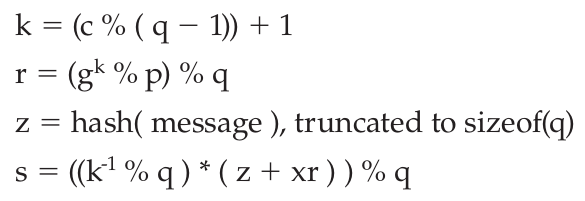
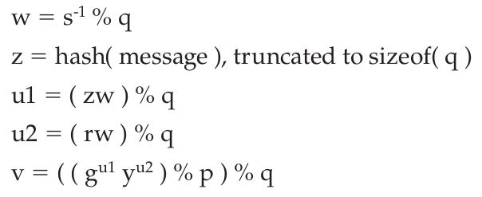

# DSA

<!-- TOC -->

- [1. Sender-Side DSA Signature Generation](#1-sender-side-dsa-signature-generation)
- [2. Receiver-Side DSA Signature Verification](#2-receiver-side-dsa-signature-verification)
- [3. Wrap Up](#3-wrap-up)
- [4. Reference](#4-reference)

<!-- /TOC -->

## 1. Sender-Side DSA Signature Generation

A DSA signature accepts **five input parameters**, including **the message to be signed**, and returns **two output parameters**. The **input parameters** are named `g`, `p`, `q`, and `x` (and, of course, **the message itself**). `g`, `p`, and `q` are part of **the public key**, and `x` is **the private key**.

笔记：

- （1） DSA签名算法，接受5个输入参数，有两个输出参数
- （2） 这5个输入参数包括：`g`，`p`，`q`，`x`和message hash。
- （3） 其中，`g`、`p`、`q`是公共参数；而`x`是private key，用于sign。另外，`y`是public key，用于verify。

Like RSA, the signature is performed on a secure hash of the message to be signed. However, the hash algorithm is somewhat part of the signature, so you can’t necessarily just pick a random signature algorithm and try to apply it. **DSA** is certified for **SHA-1** and **SHA-256**; if you try to use it with some other hash algorithm, "behavior is undefined."

> 笔记：DSA不需要选择signature algorithm，而是可以直接使用SHA-1和SHA-256。

So, to generate the two-element DSA signature, whose elements are named `r` and `s` by the standard (apparently nobody ever told the FIPS people the general rule on using meaningful variable names), you perform the following computations:



where **(k<sup>-1</sup> % q)** means the inverse mod `q`.

> 笔记：这里讲inverse mod

What about this `c`? `c` is just a random number — securely generated, of course — whose **length in bits** is the same as `q`.

> 笔记：这里讲c是如何产生的

After performing these operations, you’ve generated `r` and `s`, which make up the **signature**.

> 笔记：signature是由r和s组成。

## 2. Receiver-Side DSA Signature Verification

The recipient has the DSA parameters `g`, `p`, and `q`, the public key `y` and the signature elements `r` and `s` — along with, of course, **the message itself**. From this, it needs to check to see if `r` and `s` were generated from `g`, `p`, `q`, `x`, and **the message**. The DSA way to accomplish this is to perform the following operations:



If everything went correctly, `v` is equal to `r`. Otherwise, something went wrong or the signature is faked.

> 笔记：判断的标准就是v和r是否相等。

The signature part, then, is in `r`; `s` is just transmitted to allow the recipient to invert enough of the original computation to recover `r`.

> 笔记：signature是由r和s两个部分组成，而真正签名的部分是r，而s则是为了辅助还原r而附加的变量。

The security is mostly in the secrecy of the parameter `k` — which was generated randomly in the signature stage. Since `s` depends on `k` and the private key `x` — and `x` and `y` are of course mathematically related — `v` depends on `s` and `y`.

> 笔记：  
> 在sign的过程中，r是由k计算得来的，s是由k和private key计算得到的；  
> 在verify的过程中，v是由w和public key得到的，而w是由s得到的

下面是我对DSA的抽象总结：

```text
最终的目的就是比较r和s是否相等
r <-- k
      k + private key + r + hash --> s
v <--     public  key + r + hash <-- w
```

## 3. Wrap Up

DSA keys consist of the parameters `p`, `q`, and `g`, a private key `x`, and a public key `y`. `q` must be a (random) prime number; `p - 1` must be a multiple of
`q`; and `g` is a small number (usually 2). `x`, the private key, is random, and **y = g<sup>x</sup> % p**. In general, rather than compute their own `p`, `q`, and `g`, most implementations use standardized DSA parameters. As long as `x` is random, the security of the algorithm isn’t weakened by the sharing of parameters.

## 4. Reference

- [Wiki: Digital Signature Algorithm](https://en.wikipedia.org/wiki/Digital_Signature_Algorithm)
- [Understanding the Digital Signature Algorithm (DSA)](https://flylib.com/books/en/1.188.1.74/1/)
- [Java Default Implementation of DSA](http://herongyang.com/Cryptography/DSA-Java-Default-Implementation-of-DSA.html)
