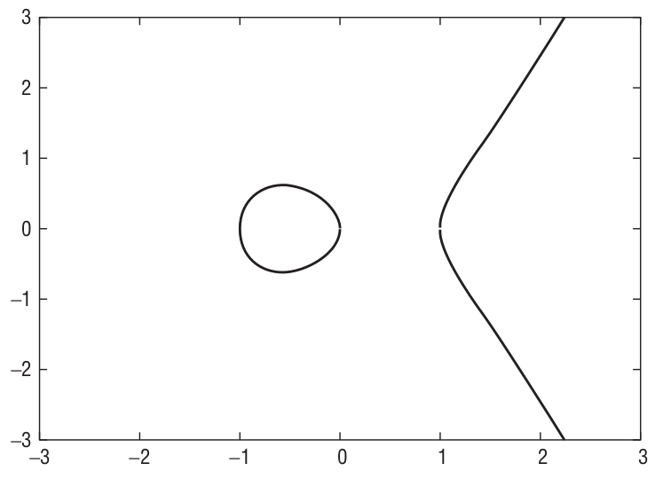
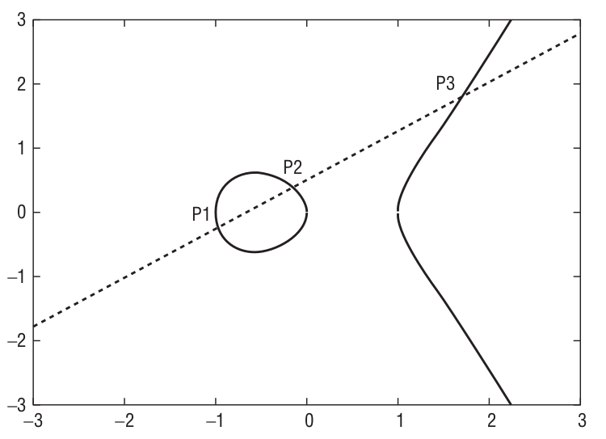
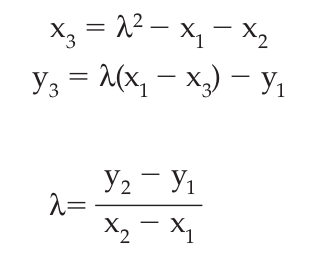
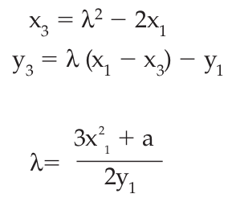

# ECC

An elliptic-curve is defined by the equation y2 = x3 + ax + b. `a` and `b` are typically fixed and, for public-key cryptography purposes, small numbers.

> 笔记：这里是讲了EC的一个通用方程

Elliptic curve with `a=-1`, `b=0`:

**Cryptographic operations** are defined in terms of **multiplicative operations** on this curve. It’s not readily apparent how one would go about "multiplying" anything on a curve, though. **Multiplication** is defined in terms of **addition**, and "addition," in ECC, is the process of drawing a line through two points and finding it’s intersection at a third point on the curve.

> 笔记：这里主要是讲如何将一个“密码学”领域里“加密问题”逐步转换为“几何”领域的“求直线与曲线之间的交点问题”

思路整理：

- （1） Cryptographic operations是依赖于在曲线上进行multiplicative operations。
- （2） 在曲线上，multiplicative operations是在addition的基础上定义的
- （3） 在曲线上，addition是由直线和曲线的交点来求得。

So, given two points p1(x1, y1), p2 (x2, y2), "addition" of points p3 = p1 + p2 is defined as:

> 笔记：这里是讲两个不同的点进行point addition

You may be able to spot a problem with this definition, though: How do you add a point to itself? A point all by itself has no slope in this case. So you need a special rule for "doubling" a point. Given p1(x1, y1), 2p1 is defined as:

> 笔记：这里的重点是point-doubling，它处理了一种特殊情况，这种特殊情况是point addition不能解决的

Remember that `a` was one of the constants in the definition of the curve.

So, armed with a **point addition** and a **point-doubling** routine, you can define **multiplication** of a **point** by a **scalar** in terms of **double** and **add**. Recall that, for integer operations, double-and-add was a "nice" speed-up. In terms of elliptic curves, though, it’s a necessity because you can’t add a point to itself a given number of times.

> 笔记：这里的重点是multiplication是在point addition和point-doubling的基础上得来的。

Notice also that **multiplication of points** is meaningless; you can add two points together, but you can only meaningfully multiply a **point** by a **scalar** value.

> 笔记：这里的重点是强调对于“multiplication”的定义，它是指point和scalar之间的乘法，而不是point与point之间的乘法。

## Reference

Standard

- [RFC 4492: Elliptic Curve Cryptography (ECC) Cipher Suites for Transport Layer Security (TLS)](https://tools.ietf.org/html/rfc4492)
- [RFC 6090: Fundamental Elliptic Curve Cryptography Algorithms](https://tools.ietf.org/html/rfc6090)

Tutorial

- [How Does Elliptic Curve Cryptography Work?](https://www.venafi.com/blog/how-does-elliptic-curve-cryptography-work)
- [A (Relatively Easy To Understand) Primer on Elliptic Curve Cryptography](https://blog.cloudflare.com/a-relatively-easy-to-understand-primer-on-elliptic-curve-cryptography/)
- [What is the math behind elliptic curve cryptography?](https://hackernoon.com/what-is-the-math-behind-elliptic-curve-cryptography-f61b25253da3)
- [Elliptic Curve Cryptography: a gentle introduction](https://andrea.corbellini.name/2015/05/17/elliptic-curve-cryptography-a-gentle-introduction/)
- [Elliptic-Curve Cryptography](https://medium.com/coinmonks/elliptic-curve-cryptography-6de8fc748b8b)
- [Elgamal Encryption using Elliptic Curve Cryptography](https://cse.unl.edu/~ssamal/crypto/EEECC.php)
- [Cryptography (CSE877)](https://cse.unl.edu/~ssamal/crypto/)
- https://cse.unl.edu/~ssamal/crypto/ECC-FinalPresentation.pdf
