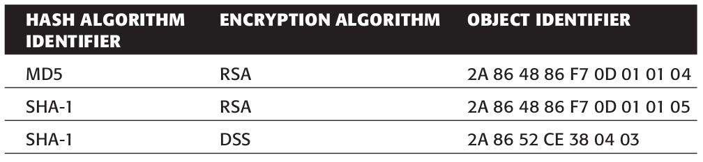

# OID Calculate

<!-- TOC -->

- [1. Intro](#1-intro)
- [2. `86 48`](#2-86-48)
- [3. `86 F7 0D`](#3-86-f7-0d)
- [4. `2A`](#4-2a)
- [5. Wrap up](#5-wrap-up)

<!-- /TOC -->



## 1. Intro

An OID in X.509 is a leaf in a very, very large tree structure. For example, the OID for the **MD5withRSA** signature algorithm is `1.2.840.113549.1.1.4`. Each number in this very long digit string identifies an element in a large hierarchy. `1` represents **iso**; `1.2` represents **iso/memberBody**; `1.2.840` represents **iso/member-body/usa** and so on. All in all, the OID in this example represents **iso/memberBody/usa/rsadsi/pkcs/pkcs1/MD5**. Each number only has meaning relative to what came before it. The **RSA** corporation controls the `1.2.840.113549` namespace and they use `1.1.4` to identify **rsa** with **pkcs #1** padding **md5**.

So how do you get from `1.2.840.113549.1.1.4` to `2A 86 48 86 F7 0D 01 01 04`? Well, the `01 01 04` part is pretty obvious: This is the byte representation of the digits `1.1.4`. But as you can see, even the third numeral, `840`, is too large to fit into a single byte. Rather than include separators, they adopted a variable-length encoding scheme (The X.500 family of specifications, which includes X.509, is big on variable-length encoding schemes). The `86 48` represents `840`, and the `86 F7 0D` represents `113549`. The encoding scheme used here is this: If **the high-order bit** is `1` then the other seven bits in this byte should be concatenated with the next byte. If **the high-order bit** is `0` then this is the last byte in the identifier.

## 2. `86 48`

So `840`, in binary, is `1101001000`. This is longer than seven bits, so break it up into chunks of seven or less:

```text
110 1001000
```

Now, add the high-order bits (and pad the first one):

```text
10000110 01001000
```

Or hexadecimal `86 48`.

The decoder then sees the first byte, recognizes that **the high-order bit** is `1`, continues on to the next byte, sees that the high-order bit is zero, and concatenates the seven lower-order bits of the two constituent bytes back into the value `1101001000`, or decimal `840`.

## 3. `86 F7 0D`

Likewise, `113549` encodes to `110 1110111 0001101` in binary. This requires 17 bits to encode, so you use three bytes, with the high-order bits of the first two being set to `1`, which tells the decoder that this should be concatenated with the next byte:

```text
10000110 11110111 00001101
```

Or `86 F7 0D` in hexadecimal.

## 4. `2A`

Is your head spinning yet? Actually, it gets worse. Notice that the hex encoding of the “1.2” on the very beginning of the OID is a single byte: `2A`. To save space, X.690 dictates that the first byte encodes two numeric elements according to the algebraic equation `Z = 40X + Y`. So, `1.2` is `40 * 1 + 2 = 42` (0x2A). On the unpacking side, it’s safe to assume that if the byte is in the range `0-40`, the decoded value should be `0`.(byte); if it’s in the range of `41-80`, it should be `1.(byte - 40)`; if it is in the range of `81-120`, it should be `2.(byte - 80)`; and so on. Obviously, this limits the range of values that can be encoded by the first byte.

## 5. Wrap up

Fortunately, I’ve done all of the conversion for you, so you don’t have to understand any of this to code around it. All you need to know is that the unique byte sequence `2A 86 48 86 F7 0D 01 01 04` represents the **MD5withRSA** signature algorithm.

Content: `iso/memberBody/usa/rsadsi/pkcs/pkcs1/MD5`

- `2A`: `1.2`, `iso/memberBody`
- `86 48`: `840`, `usa`
- `86 F7 0D`: `113549`, `rsadsi`
- `01 01 04`: `1.1.4`, `pkcs/pkcs1/MD5`
