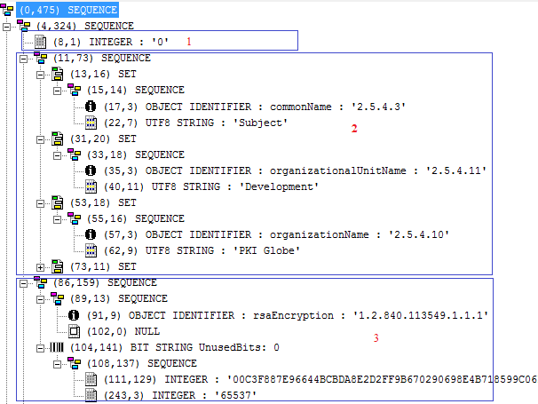
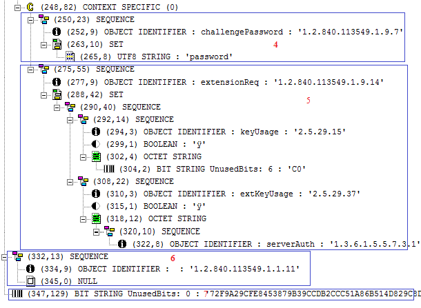

# PKCS#10

<!-- TOC -->

- [1. Intro](#1-intro)
- [2. Steps](#2-steps)
- [3. Structure](#3-structure)
- [4. Reference](#4-reference)

<!-- /TOC -->

## 1. Intro

PKCS#10 is a standard format for requesting X.509 certificates from the certification authorities.

> 笔记： 我的理解，总的来说，PKCS#N的本质就是“数据结构”，它就是将一些“简单的数据”组织成一个“复杂的数据”。而PKCS#10也是这样一个数据结构，它描述CSR的数据是如何组织的。

```text
CertificationRequest ::= SEQUENCE {
    certificationRequestInfo CertificationRequestInfo,
    signatureAlgorithm AlgorithmIdentifier{{ SignatureAlgorithms }},
    signature          BIT STRING
}

AlgorithmIdentifier {ALGORITHM:IOSet } ::= SEQUENCE {
    algorithm  ALGORITHM.&id({IOSet}),
    parameters ALGORITHM.&Type({IOSet}{@algorithm}) OPTIONAL
}

CertificationRequestInfo ::= SEQUENCE {
    version       INTEGER { v1(0) } (v1,...),
    subject       Name,
    subjectPKInfo SubjectPublicKeyInfo{{ PKInfoAlgorithms }},
    attributes    [0] Attributes{{ CRIAttributes }}
}

SubjectPublicKeyInfo {ALGORITHM: IOSet} ::= SEQUENCE {
    algorithm        AlgorithmIdentifier {{IOSet}},
    subjectPublicKey BIT STRING
}
```

## 2. Steps

The following are the steps involved from requesting a certificate to certificate issuance:

- Applicant generates a key pair i.e. private and public key.

```bash
$ openssl genrsa -aes128 -out fd.key 2048
Generating RSA private key, 2048 bit long modulus
....+++
...................................................................................↩
+++
e is 65537 (0x10001)
Enter pass phrase for fd.key: ****************
Verifying - Enter pass phrase for fd.key: ****************
```

```bash
# You can see a key’s structure using the following `rsa` command:
$ openssl rsa -text -in fd.key
Enter pass phrase for fd.key: ****************
```

- Applicant stores the private key at some secure location. The secure location could be a hardware crypto device (HSM or USB token etc) or software (PKCS#12, JKS, Windows key store or MAC key chain etc).

```bash
# Get the public key
$ openssl rsa -in fd.key -pubout -out fd-public.key
Enter pass phrase for fd.key: ****************

# Get the private key
$ openssl rsa -in fd.key -out fd-private.key
Enter pass phrase for fd.key: ****************
```

- Applicant generates a PKCS#10 structure. It mainly includes the subject information, public key generated in the above step and optionally PKCS#9 attributes.
- The applicant signs the PKCS#10 using the private key generated in the above step.

```bash
$ openssl req -new -key fd.key -out fd.csr
Enter pass phrase for fd.key: ****************
You are about to be asked to enter information that will be incorporated
into your certificate request.
What you are about to enter is what is called a Distinguished Name or a DN.
There are quite a few fields but you can leave some blank
For some fields there will be a default value,
If you enter '.', the field will be left blank.
-----
Country Name (2 letter code) [AU]:CN
State or Province Name (full name) [Some-State]:HeBei
Locality Name (eg, city) []:BaoDing
Organization Name (eg, company) [Internet Widgits Pty Ltd]:Fruit Ltd
Organizational Unit Name (eg, section) []:IT
Common Name (e.g. server FQDN or YOUR name) []:www.fruit.com
Email Address []:admin@fruit.com

Please enter the following 'extra' attributes
to be sent with your certificate request
A challenge password []:password
An optional company name []:
```

- CA receives the PKCS#10. The transport mechanism used to send the PKCS#10 to the CA could either be a standard request/response protocol (CMP, CMC, EST, SCEP, XKMS or CA proprietary interface etc) or it could involve sending PKCS#10 to CA using the SMTP protocol.
- CA first verifies the PKCS#10 signature with the public key placed in the PKCS#10. If the signature is verified successfully then it is a proof that the applicant has a possession of the corresponding private key.
- It depends on the CA policy, how much subject information and optional PKCS#9 attributes from the PKCS#10 is to be used in the final issued certificate.
- CA sends the final issued certificate along with the certificate chain to the applicant.

## 3. Structure

The structure of the PKCS#10 in ASN.1 format is shown below. You must be capable of reading the ASN.1 in order to fully understand the below PKCS#10 structure.





- (1) in red specifies the version number.
- (2) specifies the subject information. There are three RDNs (Relative Distinguished Names) currently visible in this structure i.e. CN, OU and O. Other RDNs could also be placed.
- (3) specifies the subject public key information. As RSA key is used, you can see the public modulus and exponent.
- (4) specifies the optional PKCS#9 attribute i.e. challenge password
- (5) specifies another optional PKCS#9 attribute i.e. extension request. In this section, currently key usages and extended key usages are placed. The CA could use all of these key usages or extended key usages in the final issued certificate or completely ignore it. It depends on the CA policy. As per extension request structure, one can place any of the X.509 certificate extensions including subject alternative name under this structure
- (6) specifies the signature algorithm used. In this case `1.2.840.113549.1.1.11` is used which is an OID of SHA256WithRSAEncryption algorithm.
- (7) specifies the signature value.

## 4. Reference

- [RFC 2986: PKCS #10: Certification Request Syntax Specification Version 1.7](https://tools.ietf.org/html/rfc2986) 这里详细的描述了PKCS #10的各个组成部分
- [PKCS#10](http://www.pkiglobe.org/pkcs10.html) 这里是“本文”的主体内容，它主要讲的是一个示例。
