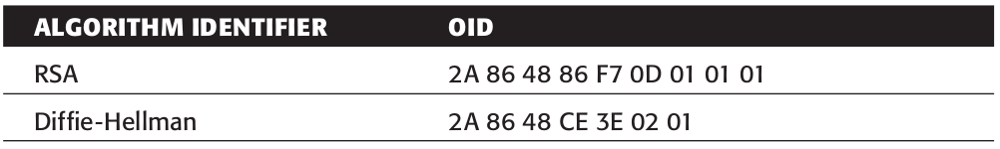

# Certificate Structure

<!-- TOC -->

- [1. Intro](#1-intro)
- [2. Certificate](#2-certificate)
- [3. TBSCertificate](#3-tbscertificate)
- [4. Version](#4-version)
- [5. AlgorithmIdentifier](#5-algorithmidentifier)
- [6. Name](#6-name)
- [7. Validity](#7-validity)
- [8. SubjectPublicKeyInfo](#8-subjectpublickeyinfo)
- [9. Extensions](#9-extensions)
  - [9.1. Extension](#91-extension)
  - [9.2. Key Usage extension](#92-key-usage-extension)
  - [9.3. Subject Alternative Name extension](#93-subject-alternative-name-extension)
  - [9.4. CertificatePolicies](#94-certificatepolicies)
- [10. Reference](#10-reference)

<!-- /TOC -->

## 1. Intro

Certificates need to be precisely defined. They’re specified instead using a syntax referred to as **Abstract Syntax Notation** (**ASN**), or **ASN.1** (the `.1` being the version of **Abstract Syntax Notation**). ASN serves the same purpose as a DTD or an XSD might serve in an XML context; it describes **how elements are nested** within one another, **what order they must occur in**, and **what type each is**.

> 笔记：Certificate是使用ASN语法来描述的。

The **certificate format** that SSL/TLS uses is defined and maintained by the **International Telecommunication Union** (**ITU**) in a series of documents they just refer to as the **X series**. The documents themselves can be found at [X Series](https://www.itu.int/rec/T-REC-X/en). Each one has a number, and the corresponding document/standard is referred to as `X.nnn` where `nnn` is a number. So, for instance, if you want to see the official standard for `X.509`, you look under [X.509 : Information technology](https://www.itu.int/rec/T-REC-X.509/en).

> 笔记：描述certificate format的官方文档为`X.509`

## 2. Certificate

```text
Certificate ::= SEQUENCE {
    tbsCertificate TBSCertificate,
    signatureAlgorithm AlgorithmIdentifier,
    signatureValue BIT STRING
}
```

## 3. TBSCertificate

```text
TBSCertificate  ::=  SEQUENCE  {
    version [0] EXPLICIT Version DEFAULT v1,
    serialNumber CertificateSerialNumber,
    signature AlgorithmIdentifier,
    issuer Name,
    validity Validity,
    subject Name,
    subjectPublicKeyInfo SubjectPublicKeyInfo,
    issuerUniqueID [1] IMPLICIT UniqueIdentifier OPTIONAL,
    subjectUniqueID [2] IMPLICIT UniqueIdentifier OPTIONAL,
    extensions [3] EXPLICIT Extensions OPTIONAL
}
```

- `issuerUniqueID`: If present, version shall be v2 or v3
- `subjectUniqueID`: If present, version shall be v2 or v3
- `extensions`: If present, version shall be v3

## 4. Version

```text
Version ::= INTEGER { v1(0), v2(1), v3(2)}
```

## 5. AlgorithmIdentifier

```text
AlgorithmIdentifier ::= SEQUENCE {
    algorithm OBJECT IDENTIFIER,
    parameters ANY DEFINED BY algorithm OPTIONAL
}
```

## 6. Name

| Two-Letter Code | Long Name                     | OID                |
| --------------- | ----------------------------- | ------------------ |
| `CN`            | Common Name                   | `0x55, 0x04, 0x03` |
| `OU`            | Organization Unit             | `0x55, 0x04, 0x0B` |
| `O`             | Organization                  | `0x55, 0x04, 0x0A` |
| `L`             | Locality, usually a city name | `0x55, 0x04, 0x07` |
| `ST`            | State                         | `0x55, 0x04, 0x08` |
| `C`             | Country                       | `0x55, 0x04, 0x06` |

## 7. Validity

```text
Validity ::= SEQUENCE {
    notBefore Time,
    notAfter Time
}

Time ::= CHOICE {
    utcTime UTCTime,
    generalTime GeneralizedTime
}
```

## 8. SubjectPublicKeyInfo

```text
SubjectPublicKeyInfo ::= SEQUENCE {
    algorithm AlgorithmIdentifier,
    subjectPublicKey BIT STRING
}
```




```text
RSAPublicKey ::= SEQUENCE {
    modulus INTEGER, -- n
    publicExponent INTEGER -- e
}
```


## 9. Extensions

There is the generic `extensions` field introduced in **X.509v3** — in fact, this was the only addition to **X.509v3**. **Certificate extensions**, if present — which they almost always are these days — are appended here. `extensions` is a nested `SEQUENCE` of object identifiers, optionally followed by `data` (depending on the object identifier).

The `extensions` type is defined as

```text
Extensions ::= SEQUENCE SIZE (1..MAX) OF Extension
```

and the `extension` type itself is defined as

```text
Extension ::= SEQUENCE {
    extnID OBJECT IDENTIFIER,
    critical BOOLEAN DEFAULT FALSE,
    extnValue OCTET STRING
}
```

Each extension has a unique **object identifier**; this **object identifier** determines how the `extnValue` is parsed, or if it’s even present. Additionally, there’s a `critical` field. If an extension is marked **critical**, and the reader doesn’t recognize it, it must reject the entire certificate; otherwise, unrecognized extensions can be ignored. Most extensions are not marked **critical**.

Incidentally(顺便提一句), all of the extension OIDs start with `55 1D`(`2.5.29`).

A complete X.509 implementation should recognize all of the extensions listed in **RFC 5280**.

### 9.1. Extension

**An extension** consists of **an OID**, an optional `critical` marker, and another optional `data` section whose interpretation varies depending on the OID.

> 笔记： extension = OID + critical + data

**The first** `tag` is always **an OID**; **the second** can be **a boolean value**, in which case it indicates whether the extension should be considered `critical` or not. Because the default of this optional value is `false`, for all intents and purposes if it’s present then the extension is `critical`.

> 笔记：这里讲前两个部分，OID和critical。第二个为boolean值，来表明是否是critical。

What differentiates a **critical** from a **non-critical extension**? According to the specification, if an implementation does not recognize an extension that is marked `critical`, it should **reject the whole certificate**. Otherwise, the extension can be safely ignored. Note that the implementation presented here is not compliant, for this reason.

> 笔记：这里讲处理规则，如果有不认识的critical extension，就应该拒绝它。

How the `data` field is interpreted depends on **the OID**. It’s always declared as an **OCTET STRING**; for all defined extensions, this is an string of bytes whose contents must in turn be parsed as **an ASN.1 DER-encoded structure**.

> 笔记：这里讲第三个部分，data field。

If the **OID** is `2.5.29.15` then the extension describes **key usage**, and the final field is **a bit field**. The bits are interpreted in big-endian order, and the most important is bit `5`. If bit `5` is set then the certificate is a CA and can legitimately sign other certificates. Presumably, the signing CA checked that this was truly the case before signing the certificate.

> 笔记：这里讲key usage，决定是否可以对其他证书进行签名。

### 9.2. Key Usage extension

If the OID is `2.5.29.15`(`55 1D 0F`) then the extension describes **key usage**, and **the final field** is **a bit field**. The bits are interpreted in big-endian order, and the most important is bit `5`. If bit `5` is set then the certificate is a CA and can legitimately sign other certificates. Presumably, the signing CA checked that this was truly the case before signing the certificate.

```text
KeyUsage ::= BIT STRING {
    digitalSignature        (0),
    nonRepudiation          (1), -- recent editions of X.509 have
                         -- renamed this bit to contentCommitment
    keyEncipherment         (2),
    dataEncipherment        (3),
    keyAgreement            (4),
    keyCertSign             (5),
    cRLSign                 (6),
    encipherOnly            (7),
    decipherOnly            (8)
}
```

### 9.3. Subject Alternative Name extension

The **Subject Alternative Name extension** (OID `2.5.29.17`, `55 1D 11`) is a useful, but not widely used, extension. This extension offers a place to specifically identify a **server’s domain name**; it also supports e-mail addresses, IP addresses, other directory names, and so on. Because the domain name is explicit, the **common-name** field no longer needs to be assumed to be the domain name. Unfortunately, this extension has failed to catch on, chiefly for the same reason the `DC` component in the subject name failed to catch on; to support older clients, servers must continue to set the common name to be the same as domain name. (In fact, it’s unclear what, if anything, ought to be in the `CN` component of a certificate’s subject when the certificate identifies a web site, if not the domain name.)

```text
SubjectAltName ::= GeneralNames

GeneralNames ::= SEQUENCE SIZE (1..MAX) OF GeneralName

GeneralName ::= CHOICE {
    otherName                       [0]     OtherName,
    rfc822Name                      [1]     IA5String,
    dNSName                         [2]     IA5String,
    x400Address                     [3]     ORAddress,
    directoryName                   [4]     Name,
    ediPartyName                    [5]     EDIPartyName,
    uniformResourceIdentifier       [6]     IA5String,
    iPAddress                       [7]     OCTET STRING,
    registeredID                    [8]     OBJECT IDENTIFIER }

OtherName ::= SEQUENCE {
    type-id    OBJECT IDENTIFIER,
    value      [0] EXPLICIT ANY DEFINED BY type-id }

EDIPartyName ::= SEQUENCE {
    nameAssigner            [0]     DirectoryString OPTIONAL,
    partyName               [1]     DirectoryString }
```

### 9.4. CertificatePolicies

The entire trust model outlined in this chapter hinges on how accurately CAs vet certificate requests.

> 笔记：证书的安全性，最终要依赖于CA是如何审查的（审查的质量）  
> 以前的时候，都是从算法（技术）的角度来保证证书的安全性，而这里讲的是还是最终要落实到“人”（因为CA的审查工作是由人来做的）

The `CertificatePolicies` extension `2.5.29.32` provides a way for the CA to indicate how it goes about verifying that the requester of a certificate is, in fact, the entity it purports to be. Recently, the CA/Browser forum began compiling a list of CAs that perform what is called **extended validation**.

**Extended validation** just indicates that a CA has made extraordinary efforts to ensure that it is signing a certificate on behalf of the true owner of the identity in question. Recent browsers have begun displaying a green bar in addition to the traditional padlock icon to tell the user that the certificate is not only valid, but that it has been signed by an **extended validation CA**.

## 10. Reference

- [2008年，RFC 5280: Internet X.509 Public Key Infrastructure Certificate and Certificate Revocation List (CRL) Profile](https://tools.ietf.org/html/rfc5280)，在第4部分，可以看到对于Certificate结构的描述。
- [1999年，RFC 2459: Internet X.509 Public Key Infrastructure Certificate and CRL Profile](https://tools.ietf.org/html/rfc2459)

- [X Series](https://www.itu.int/rec/T-REC-X/en)
- [X.509 : Information technology](https://www.itu.int/rec/T-REC-X.509/en).
