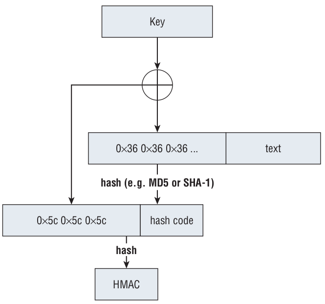

# HMAC



```text
 1 function hmac (key, message)
 2     if (length(key) > blocksize) then
 3         // keys longer than blocksize are shortened
 4         key = hash(key)
 5     end if
 6     if (length(key) < blocksize) then
 7         // keys shorter than blocksize are zero-padded
 8         key = key ∥ zeroes(blocksize - length(key))
 9     end if
10
11     // Where blocksize is that of the underlying hash function
12     o_key_pad = [0x5c * blocksize] ⊕ key
13     i_key_pad = [0x36 * blocksize] ⊕ key // Where ⊕ is exclusive or (XOR)
14     // Where ∥ is concatenation
15     return hash(o_key_pad ∥ hash(i_key_pad ∥ message))
16 end function
```

使用场景

- 服务端生成key，传给客户端；
- 客户端使用key将帐号和密码做HMAC，生成一串散列值，传给服务端；
- 服务端使用key和数据库中用户和密码做HMAC计算散列值，比对来自客户端的散列值。

## Where Does All of This Fit into SSL?

You may still be wondering what all this has to do with SSL. After all, you have **secure key exchange**<sub>笔记：这里应该指非对称加密</sub> and **symmetric cryptography**<sub>笔记：这里指对称加密</sub>. Where does the HMAC function fit in?

SSL requires that every **record**<sub>笔记：record是发送数据的一种格式</sub> first be **HMAC’ed**<sub>笔记：第一步，进行HMAC操作</sub> before being **encrypted**<sub>笔记：第二步，进行encrypt操作</sub>. This may seem like overkill — after all, **HMAC** guarantees **the integrity of a record**. But because you’re using symmetric cryptography, the odds are infinitesimally small that an attacker could modify a record in such a way that it decrypts meaningfully, at least without access to the **session key**.

> 笔记：HMAC是为了保证数据的“完整性”（the integrity of a record）。下面，就是通过一个真实的例子来讲解“保证信息的完整性”是一件非常有必要的事情。

Consider a secure application that transmits the message, “**Withdraw troops from Bunker Hill and move them to Normandy beach**.” If you run this through the **AES** algorithm with the key “**passwordsecurity**” and the initialization vector “**initializationvc**,” you get:

> Bunker Hill: 邦克山(美国马萨诸塞州波士顿港北方的小山,北美独立战争时期的古战场) hill in Boston, Massachusetts, near the site of the first battle of the American Revolution in 1775.美国独立战争期间的第一场大规模战役。战役共造成1000多名英国士兵和约400名美国爱国者伤亡。战役结果表明经验相对不足的美军在战场上能直面英军。旧战场现建有邦克山纪念碑。邦克山号航空母舰是美军第一艘以邦克山为名的军舰，以纪念美国独立战争中血腥的邦克山战役（Battle of Bunker hill）  
> Normandy beach: 诺曼地海滩。诺曼底登陆：代号“霸王行动”（英语Operation Overlord），是第二次世界大战中盟军在欧洲西线战场发起的一场大规模攻势。接近三百万士兵渡过英吉利海峡前往法国诺曼底。诺曼底战役是目前为止世界上最大的一次海上登陆作战，使第二次世界大战的战略态势发生了根本性的变化。登陆过程：1944年6月6日早6时30分，以英美两国军队为主力的盟军先头部队总计17.6万人，从英国跨越英吉利海峡，抢滩登陆诺曼底，攻下了犹他、奥马哈、金滩、朱诺和剑滩五处海滩；此后，288万盟国大军如潮水般涌入法国，势如破竹，成功开辟了欧洲大陆的第二战场。在8月19日渡过塞纳-马恩省河后结束。

```text
0xc99a87a32c57b80de43c26f762556a76bfb3040f7fc38e112d3ffddf4a5cb703
989da2a11d253b6ec32e5c45411715006ffa68b20dbc38ba6fa03fce44fd581b
```

So far, so good. An attacker can’t modify the message and move the troops — say, **to Fort Knox** — without the key. If he tries to change even one bit of the message, it decrypts to gibberish and is presumably rejected.

> 笔记：Fort Knox 诺克斯堡，是一个军事基地 U.S. military post(军事据点) and reservation in northern Hardin County(哈丁郡), central Kentucky(肯塔基州，美国中东部一州). It has been the location of the U.S. Gold Depository(金库) since 1936.  
> 这个只有3.6万人的小镇，占地面积却高达440平方公里。自从1940年美国陆军装甲兵司令部 （US Armor Center），搬到这里以后，诺克斯堡成为美国装甲力量最重要的军事训练基地，美联储的金库也设在这里。高度戒备的诺克斯堡是美国国库黄金存放处，有7道电网围护，全副武装的保安，一道重达24吨的安全门，据估计诺克斯堡有大约4570吨的黄金条，以及其他大量未知的国家宝藏。

He can, however, cut half of it off. The attacker could modify the encrypted message to be

```txt
0xc99a87a32c57b80de43c26f762556a76bfb3040f7fc38e112d3ffddf4a5cb703
```

This message is received and decrypted correctly to “**Withdraw troops from Bunker Hill**.” The recipient has no way to detect the modification. For this reason, some hash function must be used to verify the integrity of the message after it’s been decrypted. SSL mandates that every **record** be protected this way with an **HMAC** function. You examine this in more detail when the details of the SSL protocol are discussed.

Also, SSL uses the **HMAC function** quite a bit as a pseudo-random number generator. Because the output is not predictably related to the input, the HMAC function is actually used to generate the keying material from a shared secret. In fact, the HMAC function is used to generate the final HMAC secret!


## Reference

- [RFC 2104:HMAC: Keyed-Hashing for Message Authentication](https://tools.ietf.org/html/rfc2104)
