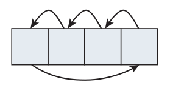

# AES Key Schedule

AES operates on **16-byte blocks**, regardless of key length. **The number of rounds** varies depending on **key length**. If the key is 128 bits (16 bytes) long, the number of rounds is 10; if the key size is 192 bits (24 bytes) long, the number of rounds is 12; and if the key size is 256 bits (32 bytes), the number of rounds is 14. In general, `rounds = (key-size in 4-byte words) + 6`.

> 笔记：第一呢，要分清两个概念 data 和 key； 第二呢，要知道the number of rounds是变化的，可能是10,可能是12,也可能是14。那么，the number of rounds是由data，还是由key来决定的呢？答案是key。因为data是固定长度，16-byte block，而key的长度是可变的，可以是128, 192, 256 bit。

Each round needs 16 bytes of keying material to work with, so the key schedule works out to 160 bytes (`10 rounds * 16 bytes per round`) for a 128-bit key; 192 bytes (`12 * 16`) for a 192-bit key; and 224 bytes (`14 * 16`) for a 256-bit key. (Actually there’s one extra key permutation at the very end, so AES requires 176, 208, and 240 bytes of keying material). Besides **the number of rounds**, the **key permutation** is the only difference between the three algorithms.

## Rotation

Rotation is straightforward and easy to understand. The first byte is overwritten with the second, the second with the third, the third with the fourth, and the fourth with the first.



```java
public static void rot_word(byte[] word_bytes) {
    byte tmp = word_bytes[0];
    word_bytes[0] = word_bytes[1];
    word_bytes[1] = word_bytes[2];
    word_bytes[2] = word_bytes[3];
    word_bytes[3] = tmp;
}
```

## Substitution

The substitution involves looking up each byte in a **translation table** and then replacing it with the value found there. The translation table is `16 x 16` bytes; **the row** is **the high-order nibble of the source byte** and **the column** is **the low-order nibble**. So, for example, the input byte `0x1A` corresponds to row `1`, column `10` of the lookup table, and input byte `0xC5` corresponds to row `12`, column `5`.

Actually, the lookup table values can be computed dynamically. According to the specification, this computation is “affine transformation”. If that means anything to you, have at it.<sub>笔记：对于affine transformation，我目前知识匮乏，还不能理解。不过，它应该和图像那部分有关系，以后如果有机会要深入了解一下。我现在的主要目的，还是要搞明白AES是如何实现的。</sub>

This isn’t something you’d want to do dynamically anyway, though, because the values never change. Instead, hardcode is much more convenient.

```java
public static int[][] sbox = {
        {0x63, 0x7c, 0x77, 0x7b, 0xf2, 0x6b, 0x6f, 0xc5, 0x30, 0x01, 0x67, 0x2b, 0xfe, 0xd7, 0xab, 0x76},
        {0xca, 0x82, 0xc9, 0x7d, 0xfa, 0x59, 0x47, 0xf0, 0xad, 0xd4, 0xa2, 0xaf, 0x9c, 0xa4, 0x72, 0xc0},
        {0xb7, 0xfd, 0x93, 0x26, 0x36, 0x3f, 0xf7, 0xcc, 0x34, 0xa5, 0xe5, 0xf1, 0x71, 0xd8, 0x31, 0x15},
        {0x04, 0xc7, 0x23, 0xc3, 0x18, 0x96, 0x05, 0x9a, 0x07, 0x12, 0x80, 0xe2, 0xeb, 0x27, 0xb2, 0x75},
        {0x09, 0x83, 0x2c, 0x1a, 0x1b, 0x6e, 0x5a, 0xa0, 0x52, 0x3b, 0xd6, 0xb3, 0x29, 0xe3, 0x2f, 0x84},
        {0x53, 0xd1, 0x00, 0xed, 0x20, 0xfc, 0xb1, 0x5b, 0x6a, 0xcb, 0xbe, 0x39, 0x4a, 0x4c, 0x58, 0xcf},
        {0xd0, 0xef, 0xaa, 0xfb, 0x43, 0x4d, 0x33, 0x85, 0x45, 0xf9, 0x02, 0x7f, 0x50, 0x3c, 0x9f, 0xa8},
        {0x51, 0xa3, 0x40, 0x8f, 0x92, 0x9d, 0x38, 0xf5, 0xbc, 0xb6, 0xda, 0x21, 0x10, 0xff, 0xf3, 0xd2},
        {0xcd, 0x0c, 0x13, 0xec, 0x5f, 0x97, 0x44, 0x17, 0xc4, 0xa7, 0x7e, 0x3d, 0x64, 0x5d, 0x19, 0x73},
        {0x60, 0x81, 0x4f, 0xdc, 0x22, 0x2a, 0x90, 0x88, 0x46, 0xee, 0xb8, 0x14, 0xde, 0x5e, 0x0b, 0xdb},
        {0xe0, 0x32, 0x3a, 0x0a, 0x49, 0x06, 0x24, 0x5c, 0xc2, 0xd3, 0xac, 0x62, 0x91, 0x95, 0xe4, 0x79},
        {0xe7, 0xc8, 0x37, 0x6d, 0x8d, 0xd5, 0x4e, 0xa9, 0x6c, 0x56, 0xf4, 0xea, 0x65, 0x7a, 0xae, 0x08},
        {0xba, 0x78, 0x25, 0x2e, 0x1c, 0xa6, 0xb4, 0xc6, 0xe8, 0xdd, 0x74, 0x1f, 0x4b, 0xbd, 0x8b, 0x8a},
        {0x70, 0x3e, 0xb5, 0x66, 0x48, 0x03, 0xf6, 0x0e, 0x61, 0x35, 0x57, 0xb9, 0x86, 0xc1, 0x1d, 0x9e},
        {0xe1, 0xf8, 0x98, 0x11, 0x69, 0xd9, 0x8e, 0x94, 0x9b, 0x1e, 0x87, 0xe9, 0xce, 0x55, 0x28, 0xdf},
        {0x8c, 0xa1, 0x89, 0x0d, 0xbf, 0xe6, 0x42, 0x68, 0x41, 0x99, 0x2d, 0x0f, 0xb0, 0x54, 0xbb, 0x16},
};
```

Performing the substitution is a matter of indexing this table with the high-order four bits of each byte of input as the row and the low-order four bits as the column.

```java
public static void sub_word(byte[] word_bytes) {
    for (int i = 0; i < 4; i++) {
        word_bytes[i] = (byte) AESConst.sbox[(word_bytes[i] & 0xF0) >> 4][word_bytes[i] & 0x0F];
    }
}
```

## XOR the round contant

Finally, the rotated, substituted value is XORed with **the round constant**. **The low-order three bytes of the round constant** are always `0`, and **the high-order byte** starts at `0x01` and shifts left every four iterations, so that it becomes `0x02` in the eighth iteration, `0x04` in the twelfth, and so on. Therefore, the first round constant, applied at iteration `#4` if the key length is 128 bits, iteration `#6` if the key length is 192 bits, and iteration `#8` if the key length is 256 bits, is `0x01000000`. The second round constant, applied at iteration `#8`, `#12`, or `#16` depending on key length, is  `x02000000`. The third at iteration `#12`, `#18`, or `#24` is `0x04000000`, and so on.<sub>注意：这里的`#n`是从`0`开始计数的</sub>

If you’ve been following closely, though, you may notice that for a 128-bit key, the round constant is left-shifted 10 times because a 128-bit key requires 44 iterations with a left-shift occurring every four iterations. However, if you left-shift a single byte eight times, you end up with zeros from that point on. Instead, AES mandates that, when the left-shift overflows, you XOR the result — which in this case is zero — with `0x1B`. Why `0x1B`? Well, take a look at the first 51 iterations of this simple operation – left shift and XOR with `0x1B` on overflow:

```text
01, 02, 04, 08, 10, 20, 40, 80, 1b, 36,
6c, d8, ab, 4d, 9a, 2f, 5e, bc, 63, c6,
97, 35, 6a, d4, b3, 7d, fa, ef, c5, 91,
39, 72, e4, d3, bd, 61, c2, 9f, 25, 4a,
94, 33, 66, cc, 83, 1d, 3a, 74, e8, cb,
8d
```

After the 51<sup>st</sup> iteration, it wraps back around to `0x01` and starts repeating.

## Key Schedule

- The **192-bit key schedule** is the same, except that the rotation, substitution and round-constant XOR is applied every **sixth iteration** instead of every fourth.
- For a **256-bit key**, rotation, substitution, and XORing happens every **eighth iteration**. Because every eight iterations doesn’t work out to that many, a 256-bit key schedule adds one small additional wrinkle — **every fourth iteration, substitution takes place**, but rotation and XOR — only take place every eighth iteration.

```java
public static List<byte[]> compute_key_schedule(byte[] key_bytes, int key_length) {
    int key_words = key_length >> 2;
    int rcon = 0x01;

    List<byte[]> list = new ArrayList<>();
    for (int i = 0; i < key_words; i++) {
        byte[] word_bytes = new byte[4];
        System.arraycopy(key_bytes, i * 4, word_bytes, 0, 4);
        list.add(word_bytes);
    }

    for (int i = key_words; i < 4 * (key_words + 7); i++) {
        byte[] word_bytes = new byte[4];
        System.arraycopy(list.get(i - 1), 0, word_bytes, 0, 4);
        if (i % key_words == 0) {
            rot_word(word_bytes);
            sub_word(word_bytes);
            if ((rcon & 0xFF) == 0) {
                rcon = 0x1b;
            }

            word_bytes[0] = (byte) ((word_bytes[0] & 0xFF) ^ rcon);
            rcon <<= 1;
        } else if ((key_words > 6) && (i % key_words == 4)) {
            sub_word(word_bytes);
        }
        xor(word_bytes, list.get(i - key_words), 4);

        list.add(word_bytes);
    }
    return list;
}
```
