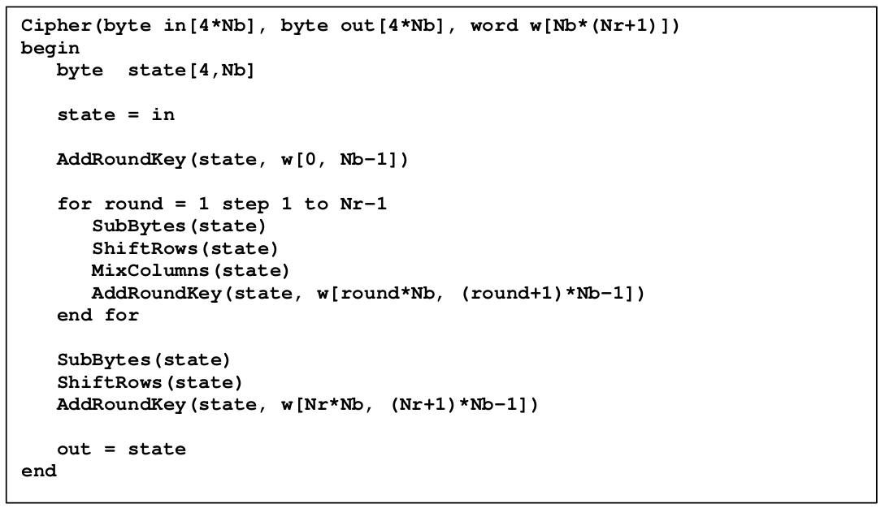
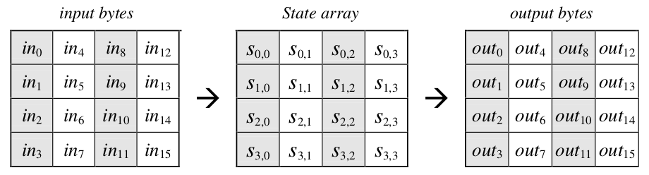
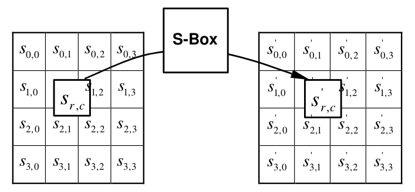
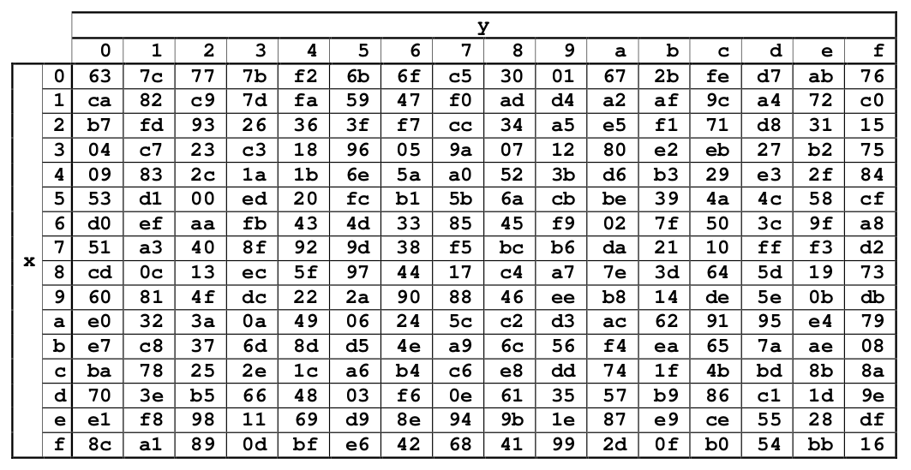
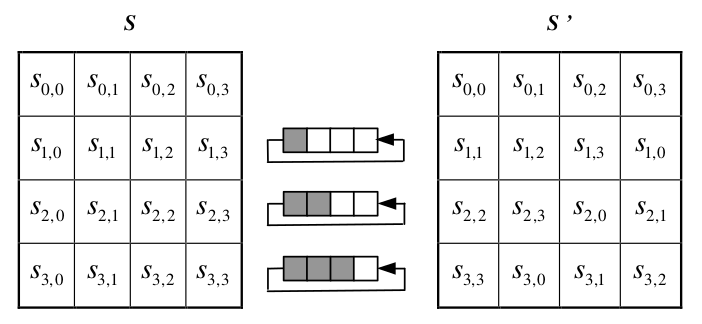
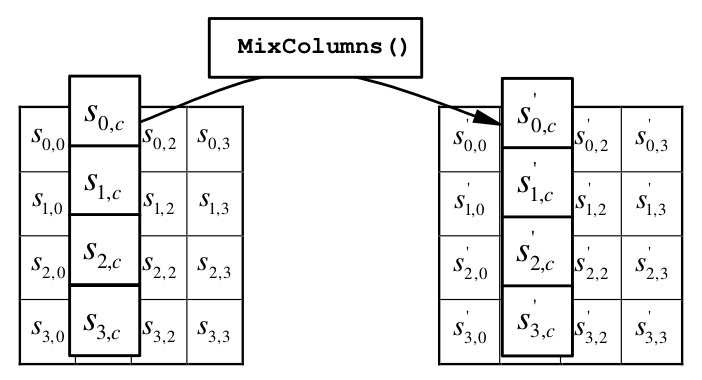
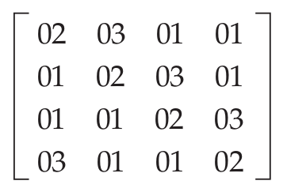
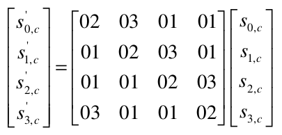
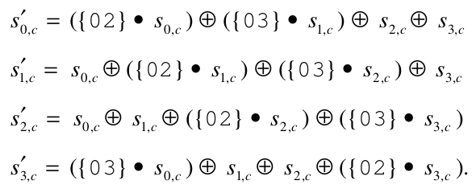

# AES Encryption

<!-- TOC -->

- [1. Pseudo Code for the Cipher](#1-pseudo-code-for-the-cipher)
- [2. add the round key](#2-add-the-round-key)
  - [2.1. from block to matrix](#21-from-block-to-matrix)
  - [2.2. XOR: state and key](#22-xor-state-and-key)
- [3. substitution](#3-substitution)
- [4. row-shifting](#4-row-shifting)
- [5. column-mixing](#5-column-mixing)
  - [5.1. the matrix](#51-the-matrix)
  - [5.2. multiply two bytes](#52-multiply-two-bytes)
  - [5.3. matrix multiplication](#53-matrix-multiplication)
- [6. Wrap Up](#6-wrap-up)

<!-- /TOC -->

## 1. Pseudo Code for the Cipher



Each round consists of **four steps**: **a substitution step**, **a row-shifting step**, **a column-mixing step**, and **finally a key combination step**.

## 2. add the round key

### 2.1. from block to matrix

With the key schedule computation defined, you can look at the actual encryption process. AES operates on **16-byte blocks** of **input**, regardless of **key size**; the input is treated as a **4 x 4 two-dimensional array of bytes**. The input is mapped vertically into this array as shown in the following Figure.


This 4 x 4 array of input is referred to as the **state**. It should come as no surprise that the encryption process, then, consists of **permuting**, **substituting**, and combining **the keying material** with this **state** to produce the output.



```java
public static void from_block_to_state(byte[] input_block, byte[][] state) {
    for (int r = 0; r < 4; r++) {
        for (int c = 0; c < 4; c++) {
            state[r][c] = input_block[r + (4 * c)];
        }
    }
}

public static void from_state_to_block(byte[] output_block, byte[][] state) {
    for (int r = 0; r < 4; r++) {
        for (int c = 0; c < 4; c++) {
            output_block[r + (4 * c)] = state[r][c];
        }
    }
}
```

### 2.2. XOR: state and key

The first thing to do is to XOR the **state** with **the first 16 bytes of keying material**, which comes directly from the key itself.


注意：

- （1） 其中，input block是按竖向排列生成4 x 4大小的state
- （2） 另外，16 bytes of key也是按照竖向排列生成4 x 4大小的word

```java
public static void add_round_key(byte[][] state, byte[][] word) {
    for (int r = 0; r < 4; r++) {
        for (int c = 0; c < 4; c++) {
            state[r][c] = (byte) (state[r][c] ^ word[r][c]);
        }
    }
}
```

Note that **this is done before the rounds begin**.

## 3. substitution

**Substitution** is performed on **each byte individually** and comes from **the same table** that the key schedule substitution came from.



For example, if `s[1][1] = 0x53`, then the substitution value would be determined by the intersection of the row with index ‘5’ and the column with index ‘3’ in the following Figure. This would result in a value of `0xed`.



```java
public static void sub_bytes(byte[][] state) {
    for (int r = 0; r < 4; r++) {
        for (int c = 0; c < 4; c++) {
            state[r][c] = (byte) AESConst.sbox[(state[r][c] & 0xF0) >> 4][state[r][c] & 0x0F];
        }
    }
}
```

## 4. row-shifting

**Row shifting** is a rotation applied to each row. The first row is rotated zero places, the second one place, the third two, and the fourth three. Graphically, this can be viewed as shown in the following Figure.



观察：

- （1） 第一行，不移动
- （2） 第二行，左移1格
- （3） 第三行，左移2格
- （4） 第四行，左移3格

```java
public static void shift_rows(byte[][] state) {
    byte tmp;
    tmp = state[1][0];
    state[1][0] = state[1][1];
    state[1][1] = state[1][2];
    state[1][2] = state[1][3];
    state[1][3] = tmp;

    tmp = state[2][0];
    state[2][0] = state[2][2];
    state[2][2] = tmp;
    tmp = state[2][1];
    state[2][1] = state[2][3];
    state[2][3] = tmp;

    tmp = state[3][3];
    state[3][3] = state[3][2];
    state[3][2] = state[3][1];
    state[3][1] = state[3][0];
    state[3][0] = tmp;
}
```

Note that for simplicity and clarity, the position shifts are just hardcoded at each row. The relative positions never change, so there’s no particular reason to compute them on each iteration.

## 5. column-mixing

**Column mixing** is where AES gets a bit confusing and where it differs considerably from DES. **The column mix step** is actually defined as **a matrix multiplication** of **each column in the source array** with **the matrix**:



If you don’t remember what **matrix multiplication** is, or you never studied linear algebra, this works out to multiplying **each element of each column** with **each element of each row** and then **adding the results** to come up with the target column. (Don’t worry, I show you some code in just a second). If you do remember linear algebra, don’t get too excited because **AES redefines the terms `multiply` and `add` to mean something completely different than what you probably consider `multiply` and `add`**.

`Adding` in AES is actually redefined as `XORing`, which is nothing at all like `adding`. `Multiplying` is repeated `adding`, just as in ordinary arithmetic, but it’s done modulo `0x1B` (remember this value from the key schedule?). The specification refers to this as a **dot product** — another linear algebra term, but again redefined. If your head is spinning from this mathematicalese, perhaps some code will help.

### 5.1. the matrix



### 5.2. multiply two bytes

To multiply two bytes — that is, to compute their **dot product** in AES — you `XOR` together the `xtime` values of the multiplicand with the multiplier. What are `xtime` values? They’re the “**left-shift** and **XOR with 0x1B on overflow**” operation that described the **round constant** in the **key schedule** computation.

```java
public static byte xtime(byte x) {
    return (byte) (((x & 0xFF) << 1) ^ (((x & 0x80) != 0) ? 0x1b : 0x00));
}

public static byte dot(byte x, byte y) {
    int product = 0;

    for (byte mask = 0x01; mask != 0; mask <<= 1) {
        if ((y & mask) != 0) {
            product ^= (x & 0xFF);
        }
        x = xtime(x);
    }

    return (byte) product;
}
```

Fortunately, from an implementation perspective, you can just accept that this is “**what you do**” with the **bytes** in a **column-mixing operation**.

### 5.3. matrix multiplication

Armed with this strange **multiplication operation**, you can implement the **matrix multiplication** that performs the column-mixing step.





```java
public static void mix_columns(byte[][] s) {
    int[] t = new int[4];
    for (int c = 0; c < 4; c++) {
        t[0] = dot((byte) 2, s[0][c]) ^ dot((byte) 3, s[1][c]) ^ s[2][c] ^ s[3][c];
        t[1] = s[0][c] ^ dot((byte) 2, s[1][c]) ^ dot((byte) 3, s[2][c]) ^ s[3][c];
        t[2] = s[0][c] ^ s[1][c] ^ dot((byte) 2, s[2][c]) ^ dot((byte) 3, s[3][c]);
        t[3] = dot((byte) 3, s[0][c]) ^ s[1][c] ^ s[2][c] ^ dot((byte) 2, s[3][c]);

        s[0][c] = (byte) t[0];
        s[1][c] = (byte) t[1];
        s[2][c] = (byte) t[2];
        s[3][c] = (byte) t[3];
    }
}
```

## 6. Wrap Up

Each round consists of **substituting**, **shifting**, **column mixing**, and finally **adding the round key**. Encrypting a block of AES, then, can be done
as follows:

```java
public static void aes_block_encrypt(byte[] input_block, byte[] output_block, byte[] key_bytes, int key_size) {
    byte[][] state = new byte[4][4];
    from_block_to_state(input_block, state);

    // rounds = key size in 4-byte words + 6
    int nr = (key_size >> 2) + 6;

    List<byte[]> key_list_bytes = compute_key_schedule(key_bytes, key_size);
    byte[][] word_bytes = new byte[4][4];
    fill_word_bytes(key_list_bytes, 0, word_bytes);

    add_round_key(state, word_bytes);

    for (int round = 0; round < nr; round++) {
        sub_bytes(state);

        shift_rows(state);

        if (round < (nr - 1)) {
            mix_columns(state);
            display(state);
        }

        fill_word_bytes(key_list_bytes, (round + 1) * 4, word_bytes);

        add_round_key(state, word_bytes);
    }

    from_state_to_block(output_block, state);
}

public static void fill_word_bytes(List<byte[]> list, int i, byte[][] word_bytes) {
    for (int c = 0; c < 4; c++) {
        byte[] bytes = list.get(i + c);
        for (int r = 0; r < 4; r++) {
            word_bytes[r][c] = bytes[r];
        }
    }
}
```

Notice this same routine handles 128-, 192-, or 256-bit key sizes; the only difference between the three is **the number of rounds**, and **the amount of key material** that therefore needs to be computed.
