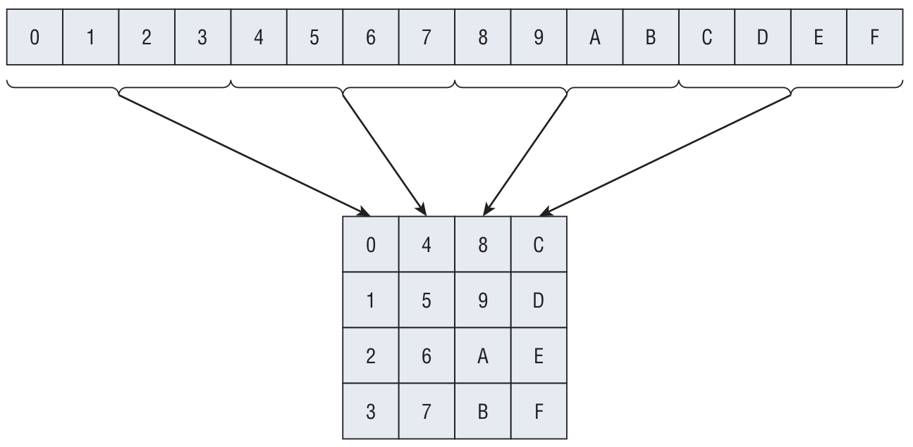
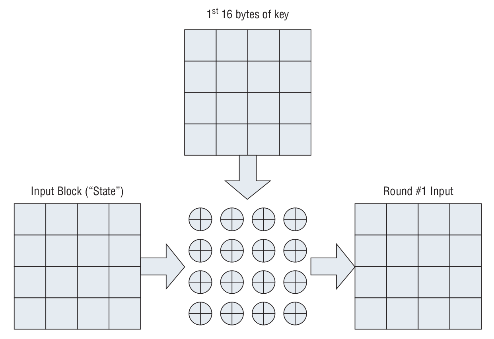

# AES Encryption

<!-- TOC -->

- [1. from block to matrix](#1-from-block-to-matrix)
- [2. XOR: state and key](#2-xor-state-and-key)
- [3. rounds](#3-rounds)
  - [3.1. substitution](#31-substitution)
  - [3.2. row-shifting](#32-row-shifting)
  - [3.3. column-mixing](#33-column-mixing)
  - [3.4. key combination](#34-key-combination)

<!-- /TOC -->

## 1. from block to matrix

With the key schedule computation defined, you can look at the actual encryption process. AES operates on **16-byte blocks** of **input**, regardless of **key size**; the input is treated as a **4 x 4 two-dimensional array of bytes**. The input is mapped vertically into this array as shown in the following Figure.

This 4 x 4 array of input is referred to as the **state**. It should come as no surprise that the encryption process, then, consists of **permuting**, **substituting**, and combining **the keying material** with this **state** to produce the output.

## 2. XOR: state and key

The first thing to do is to XOR the **state** with **the first 16 bytes of keying material**, which comes directly from the key itself.

## 3. rounds

### 3.1. substitution

### 3.2. row-shifting

### 3.3. column-mixing

### 3.4. key combination

