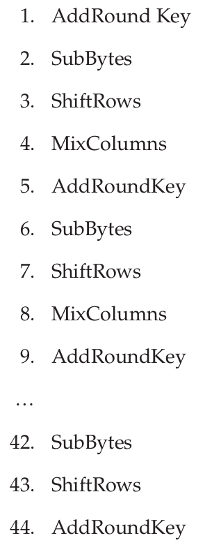
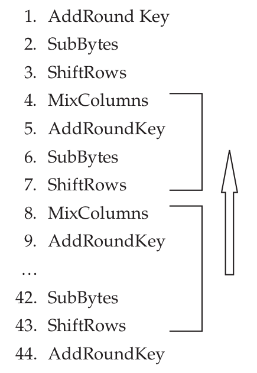
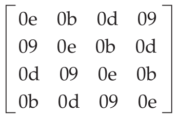

# AES Decryption

Unlike DES, AES’s decryption operation isn’t the same as encryption. You have to go back and undo everything that you did during the encryption step. This starts, of course, with **re-applying the round keys in reverse order**, **unmixing the columns**, **unshifting the rows**, and **unsubstituting the bytes**.

Do everything in exactly the inverse order that you did it when encrypting. This means that the loops occur in different orders. Look at the expanded set of operations for an encryption:



This means that the decrypt loop won’t be the same as the encrypt loop. It starts with an `AddRoundKey` and is then followed by `invShiftRows`, `invSubBytes`, `addRoundKey`, and `invMixColumns`:



And then, a final `invShiftRows`, `invSubBytes` and `addRoundKey`. Notice that `shiftRows`, `subBytes` and `mixColumns` all need specific inversion routines whereas `addRoundKey` is its own inverse, because it’s just applying the **XOR** operation.

## inv_shift_rows

```java
public static void inv_shift_rows(byte[][] state) {
    byte tmp = state[1][2];
    state[1][2] = state[1][1];
    state[1][1] = state[1][0];
    state[1][0] = state[1][3];
    state[1][3] = tmp;

    tmp = state[2][0];
    state[2][0] = state[2][2];
    state[2][2] = tmp;
    tmp = state[2][1];
    state[2][1] = state[2][3];
    state[2][3] = tmp;

    tmp = state[3][0];
    state[3][0] = state[3][1];
    state[3][1] = state[3][2];
    state[3][2] = state[3][3];
    state[3][3] = tmp;
}
```

## inv_sub_bytes

```java
public static void inv_sub_bytes(byte[][] state) {
    for (int r = 0; r < 4; r++) {
        for (int c = 0; c < 4; c++) {
            state[r][c] = (byte) AESConst.inv_sbox[(state[r][c] & 0xF0) >> 4][state[r][c] & 0x0F];
        }
    }
}
```

`inv_shift_rows` and `inv_sub_bytes` are fairly straightforward; notice that the **s-boxes** that AES uses are not invertible like DES’s were. You need two sets of s-boxes to encrypt and decrypt. There’s no computation involved in the **inverted s-box**. If you turn back to the “forward” s-box, you see that, for example, `substitution(0x75) = sbox[7][5] = 0x9d`. Conversely, `inv_substitution(0x9d) = inv_sbox[9][d] = 0x75`.

## inv_mix_columns

**Inverting column mixing** involves performing a **matrix multiplication** of each column by the inversion of the matrix that the encryption operation multiplied it by.

### the matrix



```java
public static void inv_mix_columns(byte[][] s) {
    int[] t = new int[4];
    for (int c = 0; c < 4; c++) {
        t[0] = dot((byte) 0x0e, s[0][c]) ^ dot((byte) 0x0b, s[1][c]) ^
                dot((byte) 0x0d, s[2][c]) ^ dot((byte) 0x09, s[3][c]);
        t[1] = dot((byte) 0x09, s[0][c]) ^ dot((byte) 0x0e, s[1][c]) ^
                dot((byte) 0x0b, s[2][c]) ^ dot((byte) 0x0d, s[3][c]);
        t[2] = dot((byte) 0x0d, s[0][c]) ^ dot((byte) 0x09, s[1][c]) ^
                dot((byte) 0x0e, s[2][c]) ^ dot((byte) 0x0b, s[3][c]);
        t[3] = dot((byte) 0x0b, s[0][c]) ^ dot((byte) 0x0d, s[1][c]) ^
                dot((byte) 0x09, s[2][c]) ^ dot((byte) 0x0e, s[3][c]);
        s[0][c] = (byte) t[0];
        s[1][c] = (byte) t[1];
        s[2][c] = (byte) t[2];
        s[3][c] = (byte) t[3];
    }
}
```

## aes_block_decrypt

```java
public static void aes_block_decrypt(byte[] input_block, byte[] output_block, byte[] key_bytes, int key_size) {
    byte[][] state = new byte[4][4];

    from_block_to_state(input_block, state);

    // rounds = key size in 4-byte words + 6
    int nr = (key_size >> 2) + 6;

    List<byte[]> key_list_bytes = compute_key_schedule(key_bytes, key_size);

    byte[][] word_bytes = new byte[4][4];
    fill_word_bytes(key_list_bytes, nr * 4, word_bytes);

    add_round_key(state, word_bytes);

    for (int round = nr; round > 0; round--) {
        inv_shift_rows(state);

        inv_sub_bytes(state);

        fill_word_bytes(key_list_bytes, (round - 1) * 4, word_bytes);
        add_round_key(state, word_bytes);

        if (round > 1) {
            inv_mix_columns(state);
        }
    }

    from_state_to_block(output_block, state);
}
```

