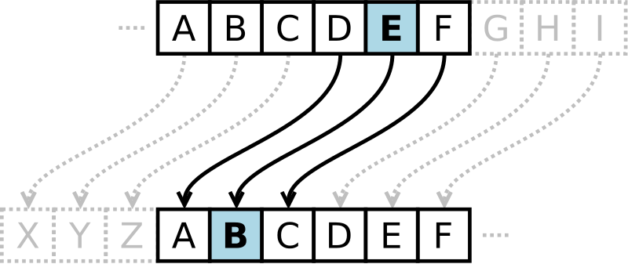

# Caesar cipher

凯撒密码(Caesar cipher)是一种非常古老的加密方法，相传当年凯撒大地行军打仗时为了保证自己的命令不被敌军知道，就使用这种特殊的方法进行通信，以确保信息传递的安全。

In cryptography, a **Caesar cipher**, also known as **Caesar's cipher**, the **shift cipher**, is one of the simplest and most widely known encryption techniques. It is a type of substitution cipher in which each letter in the plaintext is replaced by a letter some fixed number of positions down the alphabet.

> Caesar cipher的本质就是将letter进行shift操作。

For example, with a left shift of 3, `D` would be replaced by `A`, `E` would become `B`, and so on. The method is named after Julius Caesar, who used it in his private correspondence.

> correspondence = 来往信件

The encryption step performed by a Caesar cipher is often incorporated as part of more complex schemes, such as the **Vigenère cipher**, and still has modern application in the **ROT13** system.

> Caesar cipher可以被借用到更复杂的加密算法当中。

As with all single-alphabet substitution ciphers, the Caesar cipher is easily broken and in modern practice offers essentially no communications security.

> 在现在这个年代，Caesar cipher已经是一个不太安全的加密方式了。

## ROT13

**ROT13** ("rotate by 13 places", sometimes hyphenated ROT-13) is a simple letter substitution cipher that replaces a letter with the 13th letter after it, in the alphabet. **ROT13** is a **special case** of the **Caesar cipher** which was developed in ancient Rome.

> 其中，最重要的一点，就是ROT13是Caesar cipher一种特殊形式。

Because there are 26 letters (2×13) in the basic Latin alphabet, ROT13 is its own inverse; that is, to undo ROT13, the same algorithm is applied, so the same action can be used for encoding and decoding. The algorithm provides virtually no cryptographic security, and is often cited as a canonical example of weak encryption.

ROT13 is used in online forums as a means of hiding spoilers剧情透漏, punchlines指一整段笑话中最后几句最能引人发笑的点睛之笔, puzzle solutions, and offensive materials from the casual glance.

> 它的使用场景
