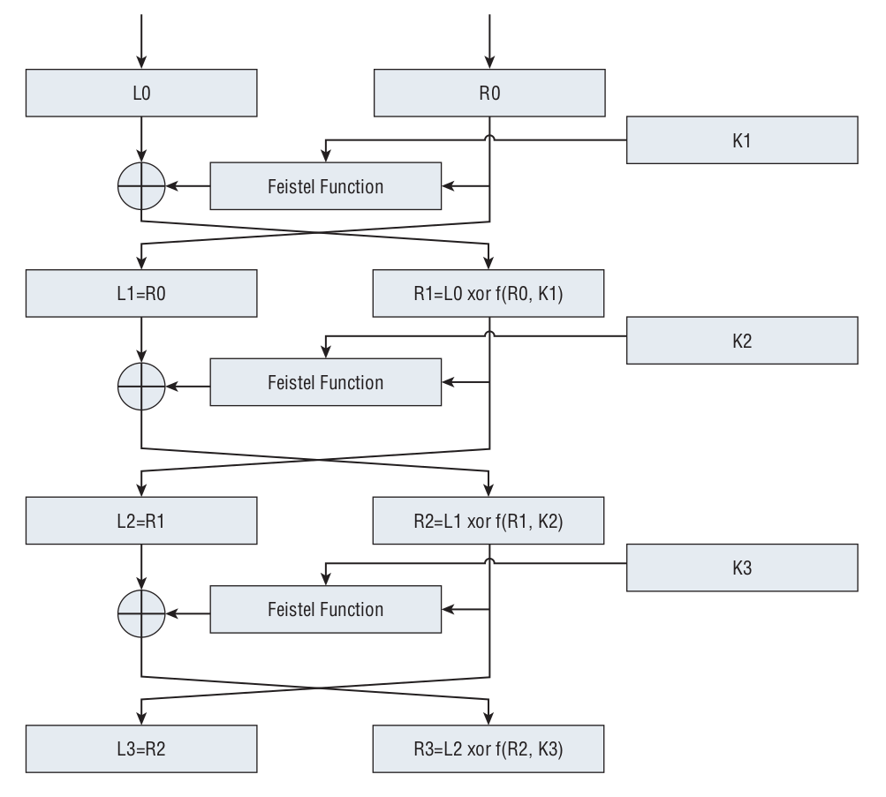

# DES

<!-- TOC -->

- [1. Initial Permutation](#1-initial-permutation)
- [2. Feistel function](#2-feistel-function)
- [3. Final permutation](#3-final-permutation)

<!-- /TOC -->

## 1. Initial Permutation

```java
/**
* Initial Permutation
*/
public static final int ip_table[] = {
    58, 50, 42, 34, 26, 18, 10, 2,
    60, 52, 44, 36, 28, 20, 12, 4,
    62, 54, 46, 38, 30, 22, 14, 6,
    64, 56, 48, 40, 32, 24, 16, 8,
    57, 49, 41, 33, 25, 17,  9, 1,
    59, 51, 43, 35, 27, 19, 11, 3,
    61, 53, 45, 37, 29, 21, 13, 5,
    63, 55, 47, 39, 31, 23, 15, 7
};
```

## 2. Feistel function

After the input has been so permuted, it is combined with the key in a series of 16 rounds, each of which consists of the following:

- (1) Expand bits 32-64 of the input to 48 bits.
- (2) XOR the expanded right half of the input with the key.
- (3) Use the output of this XOR to look up eight entries in the s-box table and overwrite the input with these contents.
- (4) Permute this output according to a specific p-table.
- (5) XOR this output with the left half of the input (bits 1–32) and swap sides so that the XORed left half becomes the right half, and the (as of yet untouched) right-half becomes the left half. On the next round, the same series of operations are applied again, but this time on what used to be the right half.

This five step procedure is referred to as the **Feistel function** after its originator.




Finally, **the halves are swapped one last time**, and the output is subject to the inverse of the initial permutation — this just undoes what the initial permutation did.

## 3. Final permutation

The final permutation table is shown as follows:

```java
/**
 * Final Permutation.
 * This just inverts ip_table.
 */
static final int fp_table[] = {
    40,8,48,16,56,24,64,32,
    39,7,47,15,55,23,63,31,
    38,6,46,14,54,22,62,30,
    37,5,45,13,53,21,61,29,
    36,4,44,12,52,20,60,28,
    35,3,43,11,51,19,59,27,
    34,2,42,10,50,18,58,26,
    33,1,41, 9,49,17,57,25
};
```
