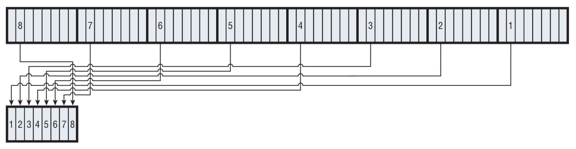
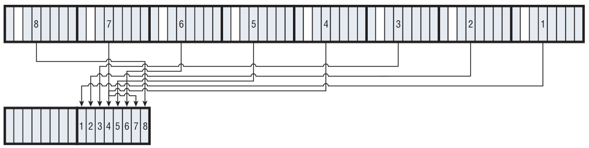
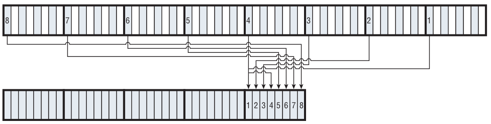

# DES Initial Permutation

DES specifies that the input should undergo **an initial permutation**. The purpose of this permutation is unclear, as it serves no cryptographic purpose (the output would be just as secure without this). It may have been added for optimization for certain hardware types. Nevertheless, if you don’t include it, your output will be wrong, and you won’t be able to interoperate with other implementations.

> 从purpose的角度来说initial permutation，其实也没有说清楚。

The specification describes this permutation in terms of the input bits and the output bits, but it works out to copying the second bit of the last byte into the first bit of the first byte of the output, followed by the second bit of the next-to-last byte into the second bit of the first byte of the output, and so on, so that the first byte of output consists of the second bits of all of the input bytes, “backward.” (Remember that the input is exactly eight-bytes long, so given an 8-bit byte, taking the second bit of each input byte yields one byte of output.) The second byte of the output is the fourth bit of each of the input bytes, again backward. The third is built from the sixth bits, the fourth from the eighth bits, and the fifth comes from the first bits, and so on.







However, the specification is given in terms of permutations. The `permute_table` for the initial permutation is shown as follows:

```java
/**
* Initial Permutation
*/
public static final int ip_table[] = {
    58, 50, 42, 34, 26, 18, 10, 2,
    60, 52, 44, 36, 28, 20, 12, 4,
    62, 54, 46, 38, 30, 22, 14, 6,
    64, 56, 48, 40, 32, 24, 16, 8,
    57, 49, 41, 33, 25, 17,  9, 1,
    59, 51, 43, 35, 27, 19, 11, 3,
    61, 53, 45, 37, 29, 21, 13, 5,
    63, 55, 47, 39, 31, 23, 15, 7
};
```
