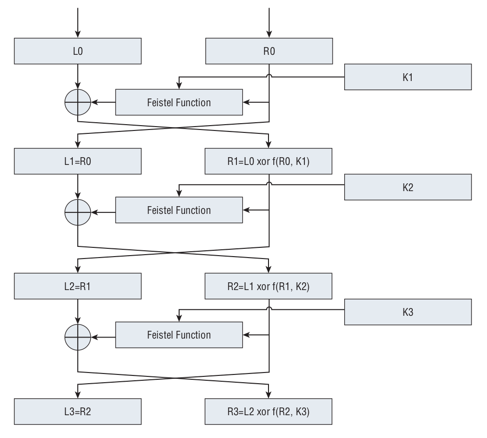
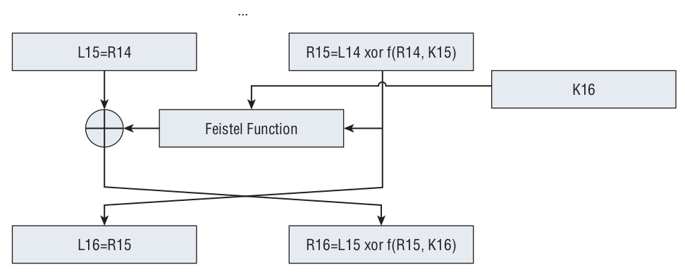

# Key Schedule

<!-- TOC -->

- [1. Initial Permutation: from 64 bit to 56 bit](#1-initial-permutation-from-64-bit-to-56-bit)
- [2. Rotation: from 56 bit to 56 bit list](#2-rotation-from-56-bit-to-56-bit-list)
- [3. Second Permutation: from 56 bit list to 48 bit list](#3-second-permutation-from-56-bit-list-to-48-bit-list)
- [4. Notice](#4-notice)

<!-- /TOC -->





If you look at the diagram, you see that the input to this XOR is shown as `K1`, `K2`, `K3`, ... `K15`, `K16`. As it turns out, there are **16** different **48-bit keys**, which are generated deterministically from the **initial 64-bit key input**.

> 笔记：一个64 bit的key转换成16个48 bit的subkey。这是怎么实现的呢？

## 1. Initial Permutation: from 64 bit to 56 bit

The **key** undergoes an **initial permutation** similar to the one that the **input** goes through, with slight differences — this time, the first byte of the output is equal to the first bits of each input byte (again, backward); the second byte is equal to the second bit of each input byte; and so on. However, the key itself is specified as two 28-bit halves — the second half works backward through the input bytes so that the first byte of the second half is the seventh bit of each input byte; the second byte is the sixth bit; and so on. Also, because the key halves are 28 bits each, there are only three and a half bytes; the last half byte follows the pattern but stops after four bits. Finally, although the key input is 8 bytes (64 bits), the output of two 28-bit halves is only 56 bits. Eight of the key bits (the least-signifi cant-bit of each input byte) are discarded and not used by DES.

> 笔记：首先，64 bit的key经过一次permutation，成为了两个28 bit的subkey，共56 bit。

Again, the DES specification presents this as a bit-for-bit permutation. This permutation table is shown as follows:

```java
public static final int pc1_table[] = {
    57, 49, 41, 33, 25, 17, 9, 1,
    58, 50, 42, 34, 26, 18, 10, 2,
    59, 51, 43, 35, 27, 19, 11, 3,
    60, 52, 44, 36,
    63, 55, 47, 39, 31, 23, 15, 7,
    62, 54, 46, 38, 30, 22, 14, 6,
    61, 53, 45, 37, 29, 21, 13, 5,
    28, 20, 12, 4
};
```

If you look carefully at this table, you see that bits `8`, `16`, `24`, `32`, `40`, `48`, `56`, and `64` — the LSBs of each input byte — never appear. Early DES implementations used more fault-prone hardware than you are probably used to — the LSBs of the keys were used as **parity bits** to ensure that the key was transmitted correctly. Strictly speaking, you should ensure that the LSB of each byte is the sum (modulo 2) of the other seven bits. Most implementers don’t bother, as you can probably trust your hardware to hang on to the key you loaded into it correctly.

## 2. Rotation: from 56 bit to 56 bit list

At each round, each of the two 28-bit halves of this 56-bit key are rotated left once or twice — once in rounds 1, 2, 9, and 16, twice otherwise.

```java
public static byte[] rotate_left(byte[] bytes) {
    int val0 = bytes[0] & 0xFF;
    int val1 = bytes[1] & 0xFF;
    int val2 = bytes[2] & 0xFF;
    int val3 = bytes[3] & 0xFF;
    int val4 = bytes[4] & 0xFF;
    int val5 = bytes[5] & 0xFF;
    int val6 = bytes[6] & 0xFF;

    int carry_left = (val0 & 0x80) >> 3;
    val0 = (val0 << 1) | ((val1 & 0x80) >> 7);
    val1 = (val1 << 1) | ((val2 & 0x80) >> 7);
    val2 = (val2 << 1) | ((val3 & 0x80) >> 7);

    // special handling for byte 3
    int carry_right = (val3 & 0x08) >> 3;
    val3 = (((val3 << 1) | ((val4 & 0x80) >> 7)) & ~0x10) | carry_left;

    val4 = (val4 << 1) | ((val5 & 0x80) >> 7);
    val5 = (val5 << 1) | ((val6 & 0x80) >> 7);
    val6 = (val6 << 1) | carry_right;

    byte[] result = new byte[7];
    result[0] = (byte) val0;
    result[1] = (byte) val1;
    result[2] = (byte) val2;
    result[3] = (byte) val3;
    result[4] = (byte) val4;
    result[5] = (byte) val5;
    result[6] = (byte) val6;
    return result;
}
```

## 3. Second Permutation: from 56 bit list to 48 bit list

These rotated halves are then permuted (surprise) according to the second permutation table.

```java
public static final int pc2_table[] = {
    14, 17, 11, 24,  1,  5,
     3, 28, 15,  6, 21, 10,
    23, 19, 12,  4, 26,  8,
    16,  7, 27, 20, 13,  2,
    41, 52, 31, 37, 47, 55,
    30, 40, 51, 45, 33, 48,
    44, 49, 39, 56, 34, 53,
    46, 42, 50, 36, 29, 32
};
```

This produces a 48-bit subkey from the 56-bit (rotated) key. Due to the rotation, this means that each round has a unique key `K1`, `K2`, `K3`, ..., `K15`, `K16`. These subkeys are referred to as the **key schedule**.

## 4. Notice

Notice that the **key schedule** is independent of the **encryption operations** and can be precomputed and stored before **encryption** or **decryption** even begins. Most DES implementations do this as a performance optimization, although this one doesn’t bother.
