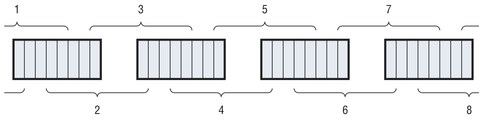

# Feistel Function

<!-- TOC -->

- [1. Permutation: right half input expansion from 32 bit to 48 bit](#1-permutation-right-half-input-expansion-from-32-bit-to-48-bit)
- [2. XOR: with 48 bit subkey](#2-xor-with-48-bit-subkey)
- [3. Substitution: s-box lookup from 48 bit to 32 bit](#3-substitution-s-box-lookup-from-48-bit-to-32-bit)
- [4. Permutation](#4-permutation)
- [5. XOR: with 32 bit left half](#5-xor-with-32-bit-left-half)
- [6. Swap: 32 bit left half and 32 bit right half](#6-swap-32-bit-left-half-and-32-bit-right-half)

<!-- /TOC -->

Notice in the previous section that the subkeys are 48-bits long, but the input halves that are to be XORed are 32 bits long. Now, you can’t properly XOR a 32-bit input with a 48-bit key, so the input is expanded — some bits are duplicated — before being XORed.

> 笔记：现在考虑的事情是，如何将32 bit的数据扩展成48 bit的数据

## 1. Permutation: right half input expansion from 32 bit to 48 bit

The output is split into eight six-bit blocks (which works out to six eight-bit bytes), with the first and last bits of each block overlapping the preceding and following blocks. Note that the first and last block wrap around and use the last bit of the input as the first bit of output and the first bit of input as the last bit of output.



Again, rather than specifying this in code, you use a permutation table as shown below:

```java
/**
 * Expansion permutation
 */
public static final int expansion_table[] = {
    32,  1,  2,  3,  4,  5,
     4,  5,  6,  7,  8,  9,
     8,  9, 10, 11, 12, 13,
    12, 13, 14, 15, 16, 17,
    16, 17, 18, 19, 20, 21,
    20, 21, 22, 23, 24, 25,
    24, 25, 26, 27, 28, 29,
    28, 29, 30, 31, 32,  1
};
```

## 2. XOR: with 48 bit subkey

## 3. Substitution: s-box lookup from 48 bit to 32 bit

After this has been XORed with the correct subkey for this round, it is fed into the **s-box lookup**. The s-boxes are what makes DES secure. It’s important that the output not be a linear function of the input; if it was, a simple statistical analysis would reveal the key.

The **s-boxes** are not **permutations**, **rotations** or **XOR**s but are **lookups** into a set of completely random tables.

Each six-bits of the input — the expanded right-half XORed with the subkey — correspond to four bits of table output. In other words, each six bits of input is used as an index into a table of four-bit outputs. In this way, the expanded, XORed right half is reduced from 48-bits to 32.

The s-boxes are described in a particularly confusing way by the DES specification. Instead, I present them here as simple lookup tables. Note that each six-bit block has its own unique s-box.

```java
/**
* S boxes - S1, S2, ..., S8: 8 * 64
*/
public static final int[][] sbox=
{
    {
        14, 0, 4, 15, 13, 7, 1, 4, 2, 14, 15, 2, 11, 13, 8, 1,
        3, 10, 10, 6, 6, 12, 12, 11, 5, 9, 9, 5, 0, 3, 7, 8,
        4, 15, 1, 12, 14, 8, 8, 2, 13, 4, 6, 9, 2, 1, 11, 7,
        15, 5, 12, 11, 9, 3, 7, 14, 3, 10, 10, 0, 5, 6, 0, 13
    },
    {
        15, 3, 1, 13, 8, 4, 14, 7, 6, 15, 11, 2, 3, 8, 4, 14,
        9, 12, 7, 0, 2, 1, 13, 10, 12, 6, 0, 9, 5, 11, 10, 5,
        0, 13, 14, 8, 7, 10, 11, 1, 10, 3, 4, 15, 13, 4, 1, 2,
        5, 11, 8, 6, 12, 7, 6, 12, 9, 0, 3, 5, 2, 14, 15, 9
    },
    {
        10, 13, 0, 7, 9, 0, 14, 9, 6, 3, 3, 4, 15, 6, 5, 10,
        1, 2, 13, 8, 12, 5, 7, 14, 11, 12, 4, 11, 2, 15, 8, 1,
        13, 1, 6, 10, 4, 13, 9, 0, 8, 6, 15, 9, 3, 8, 0, 7,
        11, 4, 1, 15, 2, 14, 12, 3, 5, 11, 10, 5, 14, 2, 7, 12
    },
    {
        7, 13, 13, 8, 14, 11, 3, 5, 0, 6, 6, 15, 9, 0, 10, 3,
        1, 4, 2, 7, 8, 2, 5, 12, 11, 1, 12, 10, 4, 14, 15, 9,
        10, 3, 6, 15, 9, 0, 0, 6, 12, 10, 11, 1, 7, 13, 13, 8,
        15, 9, 1, 4, 3, 5, 14, 11, 5, 12, 2, 7, 8, 2, 4, 14
    },
    {
        2, 14, 12, 11, 4, 2, 1, 12, 7, 4, 10, 7, 11, 13, 6, 1,
        8, 5, 5, 0, 3, 15, 15, 10, 13, 3, 0, 9, 14, 8, 9, 6,
        4, 11, 2, 8, 1, 12, 11, 7, 10, 1, 13, 14, 7, 2, 8, 13,
        15, 6, 9, 15, 12, 0, 5, 9, 6, 10, 3, 4, 0, 5, 14, 3
    },
    {
        12, 10, 1, 15, 10, 4, 15, 2, 9, 7, 2, 12, 6, 9, 8, 5,
        0, 6, 13, 1, 3, 13, 4, 14, 14, 0, 7, 11, 5, 3, 11, 8,
        9, 4, 14, 3, 15, 2, 5, 12, 2, 9, 8, 5, 12, 15, 3, 10,
        7, 11, 0, 14, 4, 1, 10, 7, 1, 6, 13, 0, 11, 8, 6, 13
    },
    {
        4, 13, 11, 0, 2, 11, 14, 7, 15, 4, 0, 9, 8, 1, 13, 10,
        3, 14, 12, 3, 9, 5, 7, 12, 5, 2, 10, 15, 6, 8, 1, 6,
        1, 6, 4, 11, 11, 13, 13, 8, 12, 1, 3, 4, 7, 10, 14, 7,
        10, 9, 15, 5, 6, 0, 8, 15, 0, 14, 5, 2, 9, 3, 2, 12
    },
    {
        13, 1, 2, 15, 8, 13, 4, 8, 6, 10, 15, 3, 11, 7, 1, 4,
        10, 12, 9, 5, 3, 6, 14, 11, 5, 0, 0, 14, 12, 9, 7, 2,
        7, 2, 11, 1, 4, 14, 1, 7, 9, 4, 12, 10, 14, 8, 2, 13,
        0, 15, 6, 12, 10, 9, 13, 0, 15, 3, 3, 5, 5, 6, 8, 11
    }
};
```

## 4. Permutation

After substitution, the input block undergoes a final permutation.

```java
/**
 * Round permutation: 4 * 8
 */
static final int p_table[] = {
    16,  7, 20, 21,
    29, 12, 28, 17,
     1, 15, 23, 26,
     5, 18, 31, 10,
     2,  8, 24, 14,
    32, 27,  3,  9,
    19, 13, 30,  6,
    22, 11,  4, 25
};
```

All of this is performed on the right-half of the input, which is then XORed with the left half, becoming the new right-half, and the old right-half, before any transformation, becomes the new left half.

## 5. XOR: with 32 bit left half

## 6. Swap: 32 bit left half and 32 bit right half


